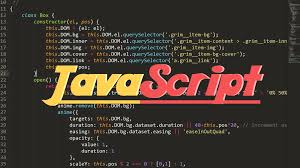
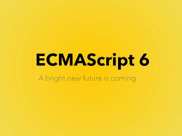

# &nbsp;&nbsp;&nbsp;&nbsp;&nbsp;&nbsp;&nbsp;&nbsp;&nbsp;&nbsp;&nbsp;&nbsp;&nbsp;对前端三大件的地位和作用的理解

>前端开发很让人着迷啊。

&nbsp;&nbsp;&nbsp;&nbsp;&nbsp;&nbsp;&nbsp;其实去年6月差不多就接触到了前端，因为那会我高中几个同学打算高中毕业了创业搞个项目，项目的web应用开发，小程序开发等等都需要用到前端的知识，于是也就提前了解了一下。不过没有太深入的去想过前端开发中HTML，CSS，JavaScript这三门语言（准确讲，HTML不算计算机语言，它只是一种标记语言）到底在前端开发中的地位和作用，只是单纯的想了想HTML就是完成网页的基本结构和内容的，CSS是用来修饰网页让网页变得更漂亮的，而js是能让网页锦上添花的东西，因为它可以让网页和浏览网页的人进行一些交互，同时可以做一些网页特效什么的，总结一下就是给网页添加行为。

&nbsp;&nbsp;&nbsp;&nbsp;&nbsp;&nbsp;&nbsp;然后到了今年，4,5月份的时候，项目的一期计划已经搞出来了，于是想到要正式学学前端了，不过更多的是学习它的内部的东西，并没有太多的从宏观的角度去考虑这门语言，或者这个工具在整个我需要完成的开发任务中处在的地位和发挥的作用。

&nbsp;&nbsp;&nbsp;&nbsp;&nbsp;&nbsp;&nbsp;恰巧电子科大微软工作室的招新题让我又一次有了机会去好好了解一下前端三大件在整个web前端的地位和作用，借助搜索引擎和相关纸质书籍资料，我总结了一些内容，也算是对前端有个新的理解吧。在这里我不谈每个语言或每项技术的具体细节，只谈谈我对这门语言，这个框架或这项技术的宏观感受和理解。不一定准确，大佬勿喷。

## 0x01 关于HTML
&nbsp;&nbsp;&nbsp;&nbsp;&nbsp;&nbsp;&nbsp;HTML是什么呢？这是百度百科给出的解释：HTML称为超文本标记语言，是一种标识性的语言。它包括一系列标签．通过这些标签可以将网络上的文档格式统一，使分散的Internet资源连接为一个逻辑整体。HTML文本是由HTML命令组成的描述性文本，HTML命令可以说明文字，图形、动画、声音、表格、链接等。

&nbsp;&nbsp;&nbsp;&nbsp;&nbsp;&nbsp;&nbsp;这是个相对专业的解释，不过我对HTML有一个不同的理解。HTML是网页内容的载体，前端的另外两样东西（CSS,JavaScript）也将嵌入HTML中以发挥作用。和生态系统的生产者一样，前者是前端开发和网页“系统”的基石，后者是生态系统的基石。

&nbsp;&nbsp;&nbsp;&nbsp;&nbsp;&nbsp;&nbsp;而HTML在前端开发的众多语言，框架，标准中也是最好学的一个，相对其他的高级语言，HTML也相对简单，所以入门前端开发因此变得容易。

&nbsp;&nbsp;&nbsp;&nbsp;&nbsp;&nbsp;&nbsp;我们可以这么定义HTML在前端开发中的作用和地位：HTML是前端开发最基础，最基本的语言，同时也是前端开发中奠定网页内容，框架基础的语言，HTML构成了一个网页的最基本骨架，HTML描述了一个网站的结构语义随着线索的呈现。

## 0x02 关于CSS 
&nbsp;&nbsp;&nbsp;&nbsp;&nbsp;&nbsp;&nbsp;CSS，中文翻译过来意思是层叠样式表，是一种用来为结构化文档（如HTML，XML）添加样式的计算机语言。简单来理解，CSS的作用就是用来修饰HTML或者XML文档，可以让网页变得更漂亮，更有吸引力。

&nbsp;&nbsp;&nbsp;&nbsp;&nbsp;&nbsp;&nbsp;可以有一个类似HTML一样类比生态系统（但不是特别恰当）的比喻，CSS可以类比为生态系统的消费者，它并非生态系统所必须，但没有了消费者，生态系统的结构将非常单调。同理，没有CSS，网页也会变得十分单调无味。现在的CSS已经成为了网页开发中必须且非常重要的一环，通过CSS，网页的结构，色调，动画效果等等将会有翻天覆地的变化。

&nbsp;&nbsp;&nbsp;&nbsp;&nbsp;&nbsp;&nbsp;我们可以这么定义CSS在前端开发中的作用和地位：CSS是前端开发中非常重要的语言，它可以为HTML文档添加样式，使HTML网页变得有吸引力，有温度。CSS将HTML文件的内容和显示分隔开来。

## 0x03 关于JavaScript
&nbsp;&nbsp;&nbsp;&nbsp;&nbsp;&nbsp;&nbsp;JavaScript，在前端开发领域最著名的语言，关于它的标准修订不计其数，而关于这门与语言的讨论也是褒贬不一。它被世界上的绝大多数网页使用，同时它的使用范围随着相关技术的进步正变得越来越广泛。

&nbsp;&nbsp;&nbsp;&nbsp;&nbsp;&nbsp;&nbsp;这是维基百科上对JavaScript的描述：JavaScript（通常缩写为JS）是一种高级的、解释型的编程语言。JavaScript是一门基于原型、函数先行的语言（函数在js中是一等公民），是一门多范式的语言，它支持面向对象编程，命令式编程，以及函数式编程。它提供语法来操控文本、数组、日期以及正则表达式等，不支持I/O，比如网络、存储和图形等，但这些都可以由它的宿主环境提供支持。它已经由ECMA（欧洲电脑制造商协会）通过ECMAScript实现语言的标准化。它被世界上的绝大多数网站所使用，也被世界主流浏览器（Chrome、IE、Firefox、Safari、Opera）支持。

&nbsp;&nbsp;&nbsp;&nbsp;&nbsp;&nbsp;&nbsp;关于JavaScript，在网上随便一找，都能找到一大堆大佬关于JavaScript的理解。我没学过多久JavaScript，也只是掌握了基本语法，基本的客户端DOM操作，部分BOM操作，还有一些与后端交互的内容，而这些只是JavaScript的冰山一角。不过我很喜欢JavaScript这门语言，尽管它有时候非常混乱，非常令人迷惑，但是在写js代码的时候，我会有一种莫名其妙的舒服的感觉。

&nbsp;&nbsp;&nbsp;&nbsp;&nbsp;&nbsp;&nbsp;必须承认，JavaScript存在太多弊端，因为它的历史渊源，JavaScript也经常被很多人误解，也是因为它的历史背景。很多人会将Java和JavaScript混为一谈，我认为这很正常。毕竟Java是一门用途更加广泛，发展时间更长，营销做得更好，使用人数更多的语言，而JavaScript命名的时候又搭了一把顺风车，自然外行误解JavaScript也就不足为奇了。

&nbsp;&nbsp;&nbsp;&nbsp;&nbsp;&nbsp;&nbsp;扯了这么多，有点跑题了，谈谈我对JavaScript在前端开发的作用和地位的理解吧，JavaScript是前端开发中极其重要且用途最广泛的语言，它的功能太多太多，可以为网页添加行为，例如网页特效，动态添加元素，与用户进行交互，向服务器端请求数据，等等。可以这么讲，JavaScript是前端编程开发之王。

&nbsp;&nbsp;&nbsp;&nbsp;&nbsp;&nbsp;&nbsp;JavaScript是一门发展迅速，且前景广阔的语言，它在短短二十年间成功实现屌丝逆袭高富帅，从4年前起，每年JavaScript都有新的内容加入，每年JavaScript都会进行一次自我完善。我相信JavaScript在未来发展会越来越好。

## 0x04 总结
&nbsp;&nbsp;&nbsp;&nbsp;&nbsp;&nbsp;&nbsp;HTML负责结构， CSS负责展示， 而JavaScript（加上AJAX, JSON） 负责逻辑。于是前端编程三剑客形成了。要论这三剑客哪个最重要，实在是说不上来，因为每位剑客都在前端开发的不同模块“指点江山”。唯有三剑客齐上阵，我们才能笑傲前端开发之江湖。

